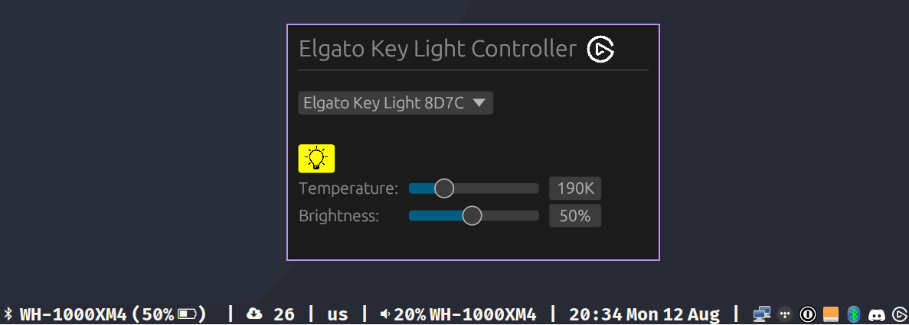

# Elgato Key Light Controller

Elgato Key Light controller for Linux distributions
* `elgato-keylight`: GUI
* `elgato-keylight-cli`: CLI



## Installation

## From the [AUR](https://aur.archlinux.org/packages/elgato-keylight)

```sh
aura|paru|yay -S elgato-keylight
```

or

```sh
git clone https://github.com/monadplus/elgato-keylight-aur
cd elgato-keylight-aur
makepkg -si
```

## Nix

Coming soon..

## Apt

Coming soon..

## Building from Source

1. Install Rust <https://www.rust-lang.org/tools/install>
2. Compile and install executables
   ```sh
   cargo install --git=https://github.com/monadplus/elgato-keylight --force
   ```
   - To enable tray icon support:
       ```sh
       cargo install --git=https://github.com/monadplus/elgato-keylight --bin=elgato-keylight --features=tray-icon --force
       ```
3. Don't forget to add to folder to your PATH
   ```sh
   $ echo 'PATH="$HOME/.cargo/bin:$PATH"' >> ~/.bashrc
   ```

### Dependencies

Required: 
* `libc`
* `openssl`
* `avahi` and `avahi-browse`

Optional:
* Desktop notifications: `libnotify`
* Tray icon: `gtk3`, `xdotool`, and `libappindicator`

How to install
* **Apt**: `$ sudo apt-get install -y build-essential libssl-dev avahi-daemon avahi-utils libnotify-dev libgtk-3-dev libxdo-dev libappindicator3-dev`
* **Pacman**: `$ sudo pacman -S openssl avahi libnotify gtk3 xdotool libappindicator-gtk3`
  - For the discovery to work, the avahi daemon must be running
    ```sh
    sudo systemctl enable avahi-daemon.service
    sudo systemctl start avahi-daemon.service
    ```

### Tested on

* Arch Linux (stable 6.9.1)
* Ubuntu 24.04 LTS

## Usage

### GUI

```sh
$ elgato-keylight
```

 

Features: 
- * Discovers devices on a background thread
     

### CLI

```sh
$ elgato-keylight-cli --help

Elgato Key Light controller for Linux

Usage: elgato-keylight-cli --ip <IP> --port <PORT> <COMMAND>

Commands:
  status            Status: on/off, brightness, temperature, etc
  toggle            Toggle (on/off)
  incr-brightness   Increase brightness by 10%
  decr-brightness   Decrease brightness by 10%
  incr-temperature  Increase temperature by 10%
  decr-temperature  Decrease temperature by 10%
  set               Set values for brightness and temperature
  help              Print this message or the help of the given subcommand(s)

Options:
      --ip <IP>      IP address
      --port <PORT>  API port
  -h, --help         Print help
  -V, --version      Print version
```

To discover the IP of your Elgato Key Light you can use:

```sh
$ elgato-keylight-discover
[
    Resolved {
        base: MdnsPacketBase {
            interface_name: "enp1s0",
            internet_protocol: V4,
            hostname: "Elgato Key Light 88DD",
            service_type: "_elg._tcp",
            domain: "local",
        },
        service: Service {
            name: "_elg._tcp",
            hostname: "elgato-key-light-8d7c.local",
            ip: 192.168.1.100,
            port: 9333,
            data: [
                "\"pv=1.0\" \"md=Elgato Key Light 20GAK9901\" \"id=FF:6A:9D:30:B1:6E\" \"dt=53\" \"mf=Elgato\"",
            ],
        },
    }
]
```

#### Docker

> Not working <https://github.com/monadplus/elgato-keylight/issues/4>

```sh
$ docker build --tag=elgato-keylight .
$ docker run -it elgato-keylight:latest
```

## Contributing

Contributions are welcome! 

Please, if you intend to do a big change, open an issue first.
